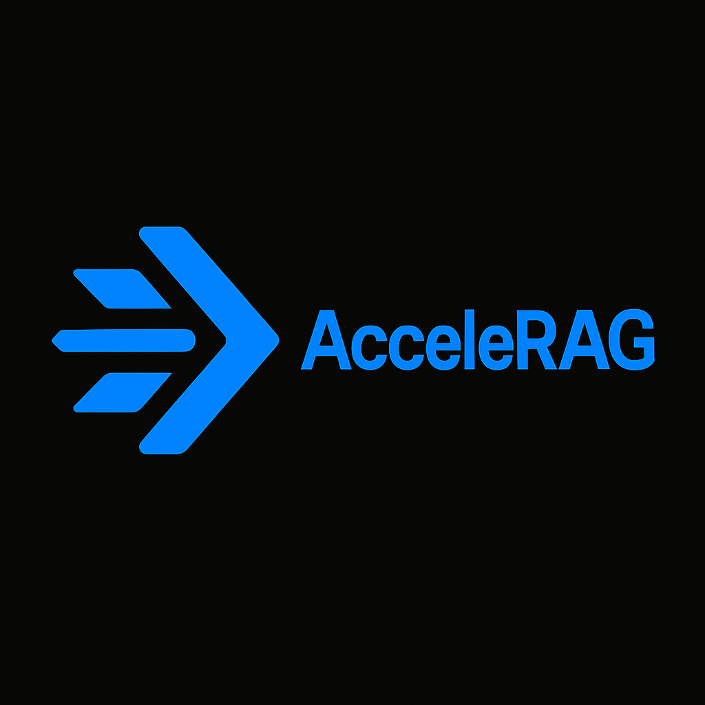
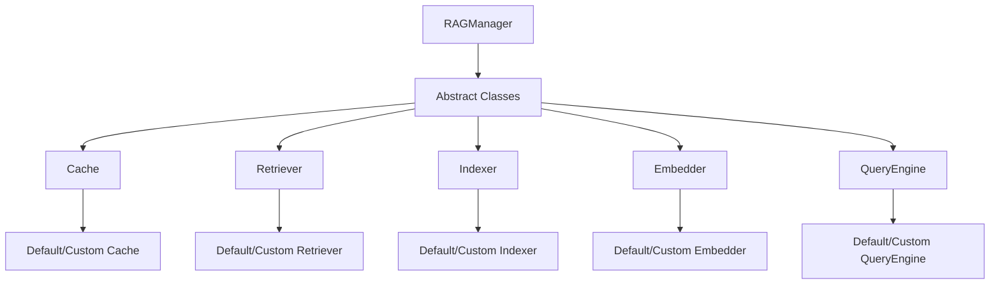
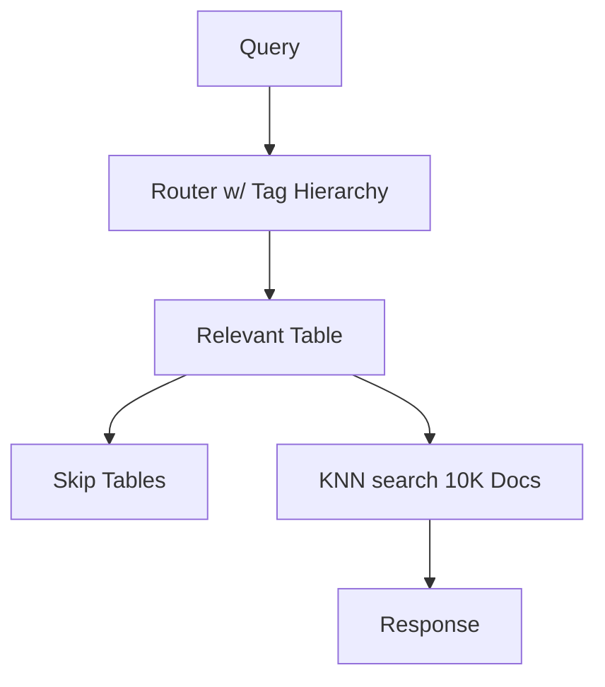
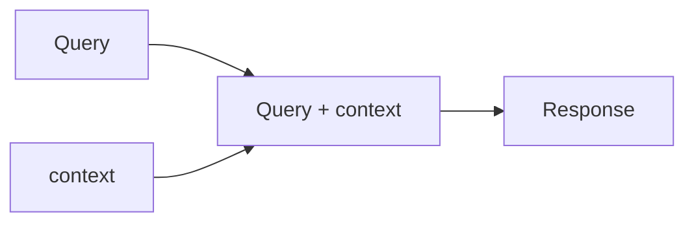

# AcceleRAG v0.10.0

A high-performance, production-ready RAG (Retrieval-Augmented Generation) framework focused on speed, accuracy, and modularity. AcceleRAG provides a fully operational text-based RAG pipeline with built-in prompt caching, and image modality support through a completely modular architecture.

<p align="center">
  
</p>


## Key Features

### Prompt Caching
- Four operational modes: No Cache, Read-Only, Write-Only, Full Cache
- Cosine similarity for cache hits
- Configurable similarity and quality thresholds
- External cache database support

### Local Embeddings
- TinyBERT (14M parameters) for text embeddings
- MobileNet for image embeddings
- Separate vector stores for each modality
- Optimized for mobile deployment

### Hallucination Control

AcceleRAG provides robust hallucination control through its scoring system and grounding modes:

#### Quality Scoring
- **JSON-based Evaluation**: Structured scoring of response quality
- **REST API Integration**: Easy integration with existing systems
- **Configurable Thresholds**: Adjust quality requirements per use case
- **Detailed Metrics**: Comprehensive evaluation of response quality

#### Scoring API Usage
```python
from managers import RAGManager

# Initialize with scoring
rag = RAGManager(
    api_key='your_key',
    dir_to_idx='docs',
    quality_thresh=8,  # Minimum quality score threshold
    logging_enabled=True  # Enable detailed scoring logs
)

# Generate response with scoring
response = rag.generate_response(
    query="Explain the key differences between RAG and traditional retrieval systems",
    grounding='hard'  # Use hard grounding for strict control
)

# The response includes quality scoring in JSON format:
{
    "score": 8,  # Overall quality score
    "response": "{llm_response}",  # Original response from LLM or more generally a QueryEngine
    "context": [  # List of context chunks with scores
        {
            "text": "{chunk}", # retrieved
            "similarity_score": 0.95
        }
    ],
    "hallucination_risk": 8,  # Risk score from evaluation
    "quality_score": 8,  # Quality score from LLM evaluation
    "evaluation": "{full_evaluation}"  # Detailed evaluation text
}


```

#### Scoring Implementation
The scoring system uses a weighted approach:
- **Quality Score**: Evaluated by LLM based on:
  - Response relevance
  - Completeness
  - Coherence
  - Context utilization
- **Hallucination Risk**: Calculated as (10 - hallucination_score)
- **Overall Score**: Weighted average of quality and hallucination risk

#### Grounding Modes

##### Hard Grounding
```python
# Hard grounding for strict hallucination control
rag = RAGManager(
    grounding='hard',  # Strongly deters hallucinations
    quality_thresh=8.0  # Quality threshold
)
```
- Strict adherence to provided context
- Higher quality thresholds
- Detailed source attribution
- Lower hallucination probability

##### Soft Grounding
```python
# Soft grounding for natural responses
rag = RAGManager(
    grounding='soft',  # Natural responses with knowledge integration
    quality_thresh=6.0  # Lower threshold for more natural responses
)
```
- More natural language generation
- Balanced knowledge integration
- Moderate quality requirements
- Controlled creativity

The scoring system helps ensure:
- Response quality meets requirements
- Hallucinations are minimized, eventually eliminated through formal guarantees 
- Context is properly utilized
- Source attribution is maintained
- Quality metrics are tracked

### Image Modality Support

AcceleRAG provides efficient image similarity search capabilities through its modular architecture. The framework enables finding similar images using visual features. Additional modalities like audio and video might be supported in future updates. 

#### Image Embedding
- **Default Model**: MobileNet for efficient image embeddings
- **Batch Processing**: Efficient handling of large image datasets
- **GPU Acceleration**: Automatic GPU utilization when available

#### Image Similarity Search
- **Visual Similarity**: Find similar images using visual features
- **Metadata Integration**: Search using image metadata and visual features
- **Efficient Indexing**: Optimized for large-scale image collections
- **Similarity Thresholds**: Configurable similarity matching

#### Use Cases

##### Synthetic Image Generation
- **Reference Image Search**: Find similar real images to guide synthetic generation
- **Style Matching**: Identify images with similar visual styles for consistent generation
- **Quality Control**: Compare generated images with real examples
- **Dataset Augmentation**: Find similar images to expand training datasets

##### Content Management
- **Duplicate Detection**: Identify similar or duplicate images
- **Content Moderation**: Detect inappropriate or similar content
- **Image Organization**: Group similar images automatically
- **Visual Search**: Find images based on visual similarity

##### Document Analysis
- **Image Extraction**: Find similar images within documents
- **Visual Pattern Recognition**: Identify recurring visual elements
- **Document Classification**: Use image similarity for document categorization

#### Example Usage
```python
from managers import RAGManager

# Initialize with image modality
rag = RAGManager(
    api_key='your_key',
    dir_to_idx='path/to/images',
    modality='image',  # Set modality to image
    device='cuda',     # Use GPU if available
    enable_cache=True, # Enable caching for faster retrieval
    cache_thresh=0.9   # NOTE - CACHING NOT YET for non-text modality!
)

# Index your image collection
rag.index()

# Find similar images
similar_images = rag.retrieve(
    query='path/to/reference.jpg',
    top_k=5  # Get top 5 most similar images
)
```

Coming soon: **AgenticImageRetrievers**:

## Framework Comparisons

| Feature | LangChain | LlamaIndex | RAGFlow | AcceleRAG |
|---------|-----------|------------|---------|-----------|
| **Architecture** | Complex abstractions, high overhead | Monolithic, limited extensibility | Basic modularity | Fully modular, dependency injection |
| **Performance** | Slow due to abstraction layers | Moderate, limited optimization | Basic performance | Optimized for speed and efficiency |
| **Caching** | Basic implementation | Simple caching | No built-in caching | Sophisticated 4-mode caching with similarity thresholds |
| **Embeddings** | Limited to specific providers | Basic embedding support | No custom embeddings | Default: TinyBERT (14M) for text, MobileNet for images. Fully customizable with any model |
| **Hallucination Control** | None | None | None | Hard/Soft grounding with quality scoring |
| **Query Routing** | Basic | None | Simple routing | Intelligent tag hierarchy routing |
| **Vendor Lock-in** | High (specific LLM providers) | Moderate | Low | None (fully modular) |
| **Production Ready** | Complex setup required | Requires customization | Basic deployment | Out-of-the-box production features |
| **Customization** | Limited by abstractions | Basic extensibility | Moderate | Complete component replacement |
| **Documentation** | Extensive but complex | Basic | Limited | Comprehensive and evolving |

## Framework Issues and Improvements

### LangChain Issues

#### 1. Performance and Resource Management
```python
# Memory leaks in conversation chains
from langchain.memory import ConversationBufferMemory
from langchain.chains import LLMChain

# No cleanup mechanism, memory grows unbounded
memory = ConversationBufferMemory()
chain = LLMChain(llm=llm, memory=memory)
for _ in range(1000):
    chain.run("What is RAG?")  # Memory leak

# CUDA/GPU issues
from langchain.embeddings import HuggingFaceEmbeddings
# Frequent CUDA errors and device mismatches
embeddings = HuggingFaceEmbeddings(device="cuda")  # Fails if CUDA not available
```

#### 2. API Inconsistencies
```python
# Breaking changes between versions
from langchain.retrievers import create_retrieval_chain
# Fails in new versions
chain = create_retrieval_chain(llm, retriever)  # AttributeError

# Streamed response issues
from langchain.chains import LLMChain
# Incompatible with multiple choices
chain = LLMChain(llm=llm, prompt=prompt)
response = chain.run(n=2)  # Fails with streaming
```

#### 3. Query Analysis Limitations
```python
# Basic similarity search without proper filtering
from langchain.vectorstores import VectorStore
results = vectorstore.similarity_search(
    "videos on RAG published in 2023"
)  # Returns irrelevant results from 2024
```

### LlamaIndex Issues

#### 1. Limited Caching
```python
# No similarity-based caching
from llama_index import VectorStoreIndex
index = VectorStoreIndex.from_documents(documents)
query_engine = index.as_query_engine()

# Each query hits the LLM
response1 = query_engine.query("What is RAG?")
response2 = query_engine.query("Can you explain RAG?")  # Hits LLM again
```

#### 2. Monolithic Architecture
```python
# Limited customization options
from llama_index import ServiceContext
# Forced to use their components
service_context = ServiceContext.from_defaults(
    llm=llm,
    embed_model=embed_model
)  # No custom implementations
```

### RAGFlow Issues

#### 1. Inflexible Pipeline
```python
# Rigid pipeline structure
from ragflow import RAGPipeline
pipeline = RAGPipeline(
    documents=docs,
    embedding_model="default",  # No custom embedding support
    retriever="default",        # No custom retrieval
    llm="default"              # No custom LLM
)
```

#### 2. Basic Query Routing
```python
# No intelligent routing
results = pipeline.query("What is RAG?")  # No control over retrieval process
```

### AcceleRAG's Solutions

#### 1. Memory and Resource Management
```python
from managers import RAGManager

# Automatic memory cleanup and resource management
rag = RAGManager(
    api_key='your_key',
    dir_to_idx='docs',
    enable_cache=True,
    cache_thresh=0.9,
    logging_enabled=True  # Track resource usage
)

# Efficient GPU utilization
rag = RAGManager(
    device='cuda',  # Graceful fallback to CPU
    embedder=CustomEmbedder()  # Use your own GPU-optimized model
)
```

#### 2. Consistent API Design
```python
# Simple, consistent interface
rag.index()  # Index documents
rag.retrieve()  # Retrieve chunks
rag.generate_response()  # Generate responses

# All components follow same interface
rag = RAGManager(
    indexer=CustomIndexer(),
    retriever=CustomRetriever(),
    query_engine=CustomQueryEngine()
)
```

#### 3. Advanced Query Analysis
```python
# Intelligent query routing with tag hierarchy
rag = RAGManager(
    dir_to_idx='docs',
    retriever=CustomRetriever()  # Custom routing logic
)

# Filtered retrieval w/ user defined CustomRetriever class
chunks = rag.retrieve(
    query="videos on RAG published in 2023",
    filters={"year": 2023}  # Proper filtering
)
```

#### 4. Sophisticated Caching
```python
# Similarity-based caching
rag = RAGManager(
    enable_cache=True,
    cache_thresh=0.9,  # Configurable threshold
    use_cache=True
)

# Cache hits for similar queries
response1 = rag.generate_response("What is RAG?")
response2 = rag.generate_response("Can you explain RAG?")  # Cache hit!
```

#### 5. Hallucination Control
```python
# Hard grounding for strict hallucination control
rag = RAGManager(
    grounding='hard',  # Strongly deters hallucinations
    quality_thresh=8.0  # Quality threshold
)

# Soft grounding for natural responses
rag = RAGManager(
    grounding='soft',  # Natural responses with knowledge integration
    quality_thresh=6.0  # Lower threshold for more natural responses
)
```

AcceleRAG addresses these issues through:
- Memory management and resource cleanup
- Flexible component customization
- Sophisticated caching with similarity matching
- No vendor lock-in
- Production-ready performance
- Consistent API design
- Built-in error handling
- Automatic resource management
- Advanced query analysis
- Hallucination control

## Framework Architecture

### Core Components


### Query Routing


### Grounding Modes


## Usage Example

```python
from managers import RAGManager

# Initialize RAG manager
rag = RAGManager(
    api_key='path/to/api_key.txt',
    dir_to_idx='path/to/documents',
    grounding='soft',
    quality_thresh=80.0,
    enable_cache=True,
    use_cache=True,
    cache_thresh=0.9,
    logging_enabled=True
)

# Index documents
rag.index()

# Generate response with retrieval
response = rag.generate_response(
    query="Explain the key differences between RAG and traditional retrieval systems",
    use_cache=True,
    cache_thresh=0.9,
    grounding='hard',
    show_similarity=True
)

# Retrieve relevant chunks
chunks = rag.retrieve(
    query="Explain the key differences between RAG and traditional retrieval systems",
    top_k=5
)
```

## Custom Component Integration

AcceleRAG's modular design allows you to easily swap in your own components. Here's how to create and integrate custom components:

### Custom Indexer
```python
from indexers import Indexer

class CustomIndexer(Indexer):
    def index(self, corpus_dir, tag_hierarchy=None, **kwargs):
        # Your custom indexing logic here
        # Example: Custom chunking strategy
        chunks = self._custom_chunking(corpus_dir)
        # Store in database
        self._store_chunks(chunks)

# Use in RAGManager
rag = RAGManager(
    api_key='your_key',
    dir_to_idx='docs',
    indexer=CustomIndexer()  # Drop in your custom indexer
)
```

### Custom Retriever
```python
from retrievers import Retriever

class CustomRetriever(Retriever):
    def retrieve(self, query, top_k=5, **kwargs):
        # Your custom retrieval logic here
        # Example: Hybrid search combining BM25 and embeddings
        bm25_results = self._bm25_search(query)
        embedding_results = self._embedding_search(query)
        return self._merge_results(bm25_results, embedding_results)

# Use in RAGManager
rag = RAGManager(
    api_key='your_key',
    dir_to_idx='docs',
    retriever=CustomRetriever()  # Drop in your custom retriever
)
```

AcceleRAG's retriever system is designed for maximum flexibility. You can implement any vector similarity search algorithm or strategy by subclassing the `Retriever` class. This includes:

- **Vector Search Algorithms**: Implement HNSW, IVF, LSH, or any other vector similarity search algorithm
- **Database Integration**: Use PostgreSQL with pgvector, SQLite, FAISS, or any other vector database
- **Hybrid Search**: Combine multiple retrieval strategies (vector, keyword, semantic)
- **Custom Filtering**: Add domain-specific filtering and reranking logic
- **Distance Metrics**: Use any distance metric for similarity calculations

Coming soon: **AgenticRetrievers** that will automatically:
- Select optimal vector search algorithms based on data characteristics
- Dynamically adjust search parameters for best performance
- Implement hybrid search strategies when beneficial
- Optimize retrieval based on query patterns
- Self-improve through metacognitive feedback loops

The framework handles all the coordination between components, so you can focus on implementing your custom retrieval logic.

### Custom Embedder
```python
from embedders import Embedder

class CustomEmbedder(Embedder):
    def embed(self, text, **kwargs):
        # Your custom embedding logic here
        # Example: Using a different model
        return self._model.encode(text)

# Use in RAGManager
rag = RAGManager(
    api_key='your_key',
    dir_to_idx='docs',
    embedder=CustomEmbedder()  # Drop in your custom embedder
)
```

### Custom Query Engine
```python
from query_engines import QueryEngine

class CustomQueryEngine(QueryEngine):
    def generate_response(self, prompt, **kwargs):
        # Your custom LLM integration here
        # Example: Using a different LLM provider
        return self._llm.generate(prompt)

# Use in RAGManager
rag = RAGManager(
    api_key='your_key',
    dir_to_idx='docs',
    query_engine=CustomQueryEngine()  # Drop in your custom query engine
)
```

Each component can be swapped independently, allowing you to:
- Use different embedding models
- Implement custom retrieval strategies
- Add specialized indexing logic
- Integrate different LLM providers

The framework handles all the component coordination, so you can focus on implementing your custom logic.

## Coming Features

### Agentic Components
- **Indexers**: 
  - Self-optimizing document chunking
  - Dynamic metadata extraction
  - Automatic tag generation
  - Quality-aware indexing

- **Retrievers**:
  - DAG-based query planning
  - Multi-hop retrieval
  - Context-aware routing
  - Adaptive similarity thresholds

### Framework Improvements
- Cross-modal search capabilities
- Distributed caching
- REST API server
- WebSocket support for streaming
- Production deployment tools
- Monitoring and metrics
- Authentication and rate limiting

## License

This repository is licensed under the GNU Affero General Public License v3.0 (AGPL-3.0). This is a strong copyleft license that requires:
- All modifications to be made available under the same license
- Network usage of the software to be made available under AGPL-3.0
- Source code to be made available to users

For the full license text, see the [LICENSE](LICENSE) file.

## Legal Disclaimer

THE SOFTWARE IS PROVIDED "AS IS", WITHOUT WARRANTY OF ANY KIND, EXPRESS OR IMPLIED, INCLUDING BUT NOT LIMITED TO THE WARRANTIES OF MERCHANTABILITY, FITNESS FOR A PARTICULAR PURPOSE AND NONINFRINGEMENT. IN NO EVENT SHALL THE AUTHORS OR COPYRIGHT HOLDERS BE LIABLE FOR ANY CLAIM, DAMAGES OR OTHER LIABILITY, WHETHER IN AN ACTION OF CONTRACT, TORT OR OTHERWISE, ARISING FROM, OUT OF OR IN CONNECTION WITH THE SOFTWARE OR THE USE OR OTHER DEALINGS IN THE SOFTWARE.
