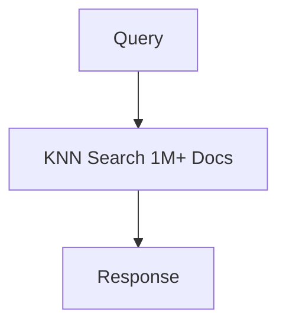
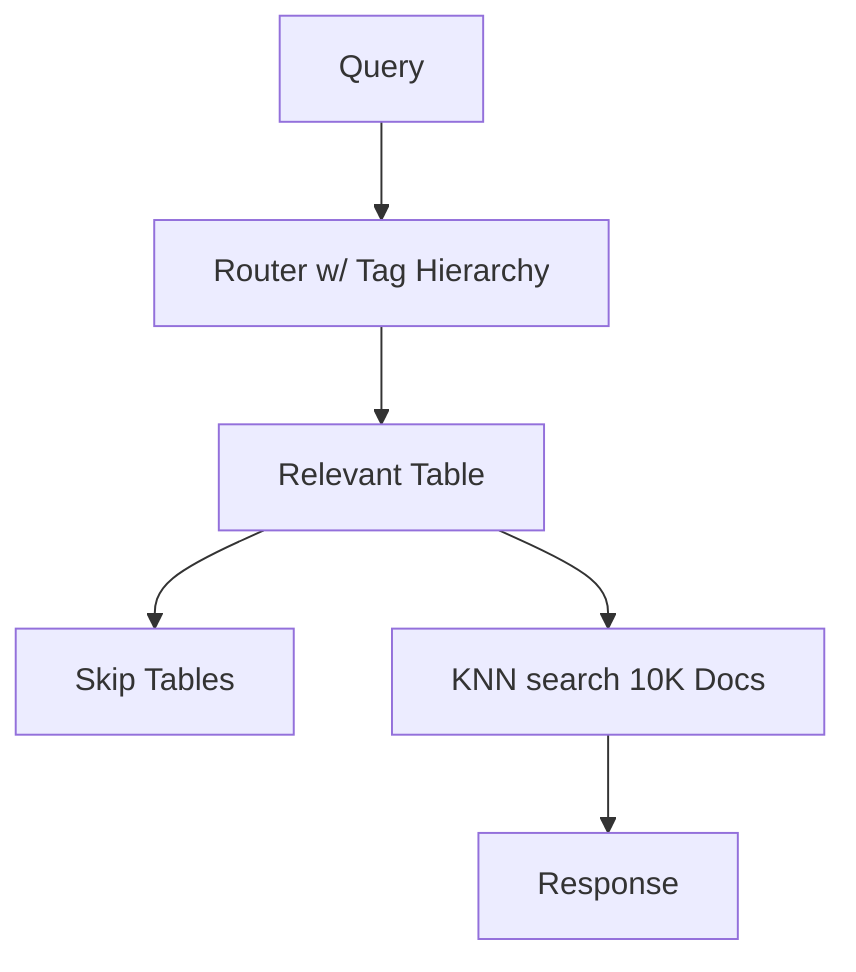
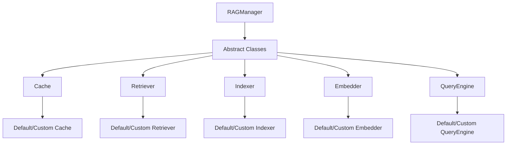
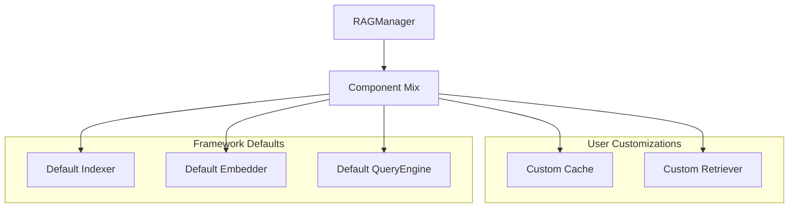

# AcceleRAG v0.9.0

A high-performance RAG (Retrieval-Augmented Generation) framework focused on speed and accuracy.

## Overview

AcceleRAG is a framework designed to provide fast and accurate document retrieval and generation capabilities. 
It features a fully operational text-based RAG pipeline with built-in prompt caching, with image and audio modalities coming soon. 
The framework is fully modular, allowing users to implement their own indexing, retrieval, and caching logic.

Key design principles:
- Modular architecture for custom implementations
- No vendor lock-in for external libraries
- Out-of-the-box functionality with sensible defaults
- Extensive and evolving documentation

## Key Features

### 1. Grounding Modes for Hallucination Control

AcceleRAG provides two grounding modes that significantly impact response quality:

1. **Hard Grounding**
   ```mermaid
   graph LR
       A[Query] --> B[Query + context]
       B --> C[Response]
       D[context] --> B
   ```
   - Documents are indexed with embeddings
   - Only uses verified user documents (enforced via a prompt)
   - Zero hallucination guarantee (model won't produce a response unless it can justify with retrieved data)
   - Best for factual accuracy enforcement
   - Ideal for technical documentation

2. **Soft Grounding**
   ```mermaid
   graph LR
       A[Query] --> B[Query + context + pre-trained knowledge]
       B --> C[Response]
   ```
   - Combines indexed docs with general knowledge
   - More natural responses
   - Better for open-ended questions
   - Higher hallucination risk but will include a disclaimer if no relevant chunks were found

### 2. TinyBERT for Efficient Embeddings

AcceleRAG uses TinyBERT by default for both indexing and query embeddings, providing significant performance benefits. 
Note that the `Embedder` class allows a drop-in replacement for TinyBERT.


#### Why BERT is Sufficient for Text Similarity

For indexing and query embedding tasks, BERT-based models are more than sufficient because:

1. **Task-Specific Optimization**
   - Text similarity is a well-defined task
   - BERT excels at semantic understanding
   - No need for full LLM capabilities
   - Focused on embedding quality, not generation

2. **Model Size Comparison**
   - BERT models are significantly smaller than full LLMs:
     - BERT: ~110M parameters
     - DistilBERT: ~66M parameters
     - TinyBERT: ~14M parameters
   - Compared to:
     - Claude: >100B parameters
     - DeepSeek: >60B parameters
     - GPT-4: possibly >1T parameters
   - This means BERT models might be 4+ orders of magnitude smaller

3. **Performance Benefits**
   - Much faster inference times
   - Lower memory requirements
   - Efficient storage
   - Better suited for real-time applications

4. **Cost Savings**
   - Significantly lower compute costs
   - Reduced storage requirements
   - Lower memory usage
   - More cost-effective for production use

### 3. Query Routing for Performance

AcceleRAG implements intelligent query routing using a tag hierarchy system:

Traditional RAG (Single Large Table):


AcceleRAG (Intelligent Routing):


Tag Hierarchy System:
1. **Directory-Based Tags**
   - Each document's directory path becomes its tag
   - Example: `/docs/api/authentication.md` → tag: `api/authentication`
   - Table name: `api_authentication`
   - Tags form a hierarchical structure

2. **Routing Process**
   - Query is analyzed for relevant tags
   - Router matches query to tag hierarchy (managed through a prompt)
   - Only relevant tables are searched
   - Irrelevant tables are skipped entirely

3. **Performance Benefits**
   - O(log n) routing vs O(n) search
   - Search space reduction: 100x+ typical
   - Example: 1M documents → 10K relevant
   - Fewer similarity computations
   - Lower database load
   - Faster response times

### 4. Flexible Caching System

AcceleRAG provides a sophisticated caching system with four operational modes:

1. **No Caching**
   ```python
   rag = RAGManager(enable_cache=False, use_cache=False)
   ```

2. **Read-Only Caching**
   ```python
   rag = RAGManager(enable_cache=False, use_cache=True)
   ```

3. **Write-Only Caching**
   ```python
   rag = RAGManager(enable_cache=True, use_cache=False)
   ```

4. **Full Caching**
   ```python
   rag = RAGManager(enable_cache=True, use_cache=True)
   ```

Cache Features:
- Cosine similarity for cache hits (default)
- Configurable similarity threshold
- Quality score threshold for caching
- Support for custom similarity metrics
- External cache database support

### 5. Modular Architecture

AcceleRAG is built on a modular architecture with dependency injection. The framework provides abstract base classes for all core components:



The Inversion of Control (IoC) principle enables flexible component composition:



Components:
1. **Cache**
   - Abstract: `PromptCache` base class
   - Default: `DefaultCache` with SQLite
   - Custom: Implement custom caching logic

2. **Retriever**
   - Abstract: `Retriever` base class
   - Default: `DefaultRetriever` with query routing
   - Custom: Implement custom retrieval logic

3. **Indexer**
   - Abstract: `Indexer` base class
   - Default: `DefaultIndexer` with TinyBERT
   - Custom: Implement custom indexing logic

4. **QueryEngine**
   - Abstract: `QueryEngine` base class
   - Default: `DefaultEngine` with Claude
   - Custom: Implement custom LLM integration

5. **Embedder**
   - Abstract: `Embedder` base class
   - Default: `TransformerEmbedder` with TinyBERT
   - Custom: Implement custom embedding logic

## Installation and Setup

### Basic Installation

1. Clone the repository:
```bash
git clone https://github.com/yourusername/accelerag.git
cd accelerag
```

2. Install dependencies:
```bash
pip install -r requirements.txt
```

## Quick Start

### Using the RAGManager

```python
from runners import RAGManager

# Basic initialization
rag = RAGManager(
    api_key='path/to/api_key.txt',  # Required for LLM operations
    dir_to_idx='path/to/documents',  # Directory to index
    grounding='soft',  # or 'hard' for strict context adherence
    quality_thresh=80.0,  # Minimum quality score for caching
    enable_cache=True,  # Enable response caching
    use_cache=True,  # Use cached responses
    cache_thresh=0.9,  # Similarity threshold for cache hits
    logging_enabled=True,  # Enable detailed logging
    query_engine=None,  # Optional custom query engine
    show_similarity=False,  # Show embedding similarity scores
    device='cpu',  # Device for embedding computation
    embedder=None,  # Optional custom embedder
    scorer=None,  # Optional custom scorer
    indexer=None,  # Optional custom indexer
    retriever=None,  # Optional custom retriever
    cache_db=None,  # Optional external cache database
    force_reindex=False  # Force reindexing if already indexed
)

# Index documents
rag.index()  # Will prompt for reindexing if already indexed

# Generate responses
response = rag.generate_response(
    query="What is the capital of France?",
    use_cache=True,  # Override instance setting
    cache_thresh=0.9,  # Override instance setting
    grounding='hard',  # Override instance setting
    show_similarity=True  # Show similarity scores
)

# Retrieve relevant chunks
chunks = rag.retrieve(
    query="What is the capital of France?",
    top_k=5  # Number of chunks to retrieve
)
```

## Custom Implementation Example

Here's a simple example of creating a custom indexer that demonstrates the framework's modularity:

```python
from base_classes import Indexer
import sqlite3
import os

class CustomIndexer(Indexer):
    """A custom indexer that splits documents by paragraphs and stores them in SQLite."""
    
    def index(self, corpus_dir, tag_hierarchy=None, db_params=None, **kwargs):
        """Index documents by splitting them into paragraphs."""
        # Connect to SQLite database
        conn = sqlite3.connect(db_params['dbname'])
        cur = conn.cursor()
        
        # Create table for storing paragraphs
        cur.execute("""
            CREATE TABLE IF NOT EXISTS paragraphs (
                id INTEGER PRIMARY KEY,
                content TEXT,
                filepath TEXT,
                tag TEXT
            )
        """)
        
        # Process each file in the corpus
        for root, _, files in os.walk(corpus_dir):
            for file in files:
                filepath = os.path.join(root, file)
                rel_path = os.path.relpath(filepath, corpus_dir)
                
                # Extract tag from path if using tag hierarchy
                tag = None
                if tag_hierarchy:
                    tag = os.path.dirname(rel_path)
                
                # Read and process file
                with open(filepath, 'r', encoding='utf-8') as f:
                    content = f.read()
                    paragraphs = content.split('\n\n')
                    
                    # Store each paragraph
                    for para in paragraphs:
                        if para.strip():  # Skip empty paragraphs
                            cur.execute(
                                "INSERT INTO paragraphs (content, filepath, tag) VALUES (?, ?, ?)",
                                (para.strip(), rel_path, tag)
                            )
        
        conn.commit()
        conn.close()

# Usage in RAGManager
rag = RAGManager(
    indexer=CustomIndexer(),  # Use our custom indexer
    dir_to_idx='path/to/documents'
)

# Index documents using custom implementation
rag.index()
```

This example demonstrates:
1. **Modularity**: Easy to implement custom indexing logic
2. **Flexibility**: Can use any storage backend (SQLite in this case)
3. **Integration**: Seamless integration with RAGManager
4. **Extensibility**: Can add custom features like tag hierarchy support

## Roadmap

### v0.9.0 (Current)
- grounding modes for hallucination control
- TinyBERT defaults for efficient embeddings
- Prompt caching
- Functional RAG pipeline as a framework

### v1.0.0 (Next)
- Comprehensive unit test suite
- Image and audio modality support
- PyPI package publishing
- REST API for RAG operations
- WebSocket support for streaming
- Authentication and rate limiting
- Production-ready documentation
- Additional embedding models
- Custom LLM support
- Advanced monitoring and metrics

## Legal Disclaimer

THE SOFTWARE IS PROVIDED "AS IS", WITHOUT WARRANTY OF ANY KIND, EXPRESS OR IMPLIED, INCLUDING BUT NOT LIMITED TO THE WARRANTIES OF MERCHANTABILITY, FITNESS FOR A PARTICULAR PURPOSE AND NONINFRINGEMENT. IN NO EVENT SHALL THE AUTHORS OR COPYRIGHT HOLDERS BE LIABLE FOR ANY CLAIM, DAMAGES OR OTHER LIABILITY, WHETHER IN AN ACTION OF CONTRACT, TORT OR OTHERWISE, ARISING FROM, OUT OF OR IN CONNECTION WITH THE SOFTWARE OR THE USE OR OTHER DEALINGS IN THE SOFTWARE.

By using AcceleRAG, you agree to:
1. Use the software at your own risk
2. Not hold the authors liable for any damages or losses
3. Comply with all applicable laws and regulations
4. Respect intellectual property rights
5. Use the software only for lawful purposes

The authors make no representations or warranties about the accuracy, reliability, timeliness, or completeness of the software or its documentation. The software may contain errors or inaccuracies that could cause failures, including but not limited to loss of data or damage to hardware. 
