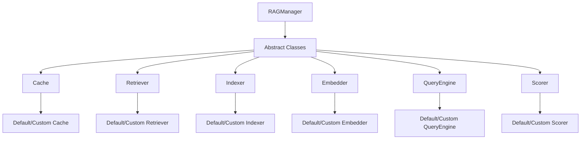
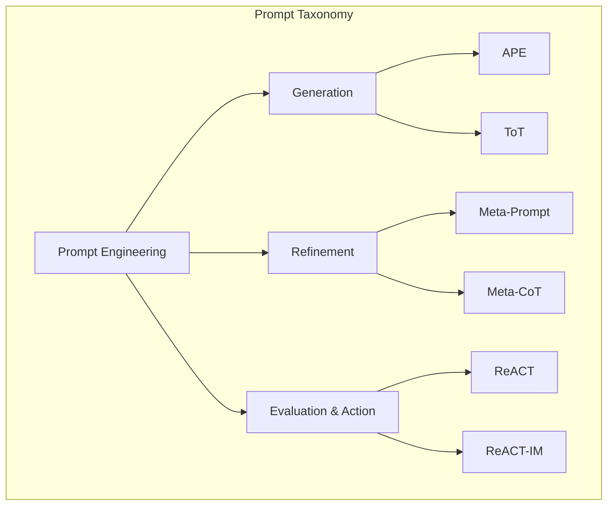

# CoTARAG v0.10.0 📊💭➡️⚙️
## License
This project is licensed under the GNU Affero General Public License v3.0 - see the [LICENSE](LICENSE) file for details. 


## Introduction

CoTARAG (Cognitive Thought and Retrieval Augmented Generation) is an agentic AI framework that solves many of the fundamental problems plauging LLM applications today. It is designed from the ground up to 
properly respect the Inversion-of-Control (IoC) principle, allowing developers to use CoTARAG directly out of the box or use any number of their own customized modules. 

CoTARAG is composed of two subframeworks - AcceleRAG and COTAEngine. They can be used completley independently or together, it depends on the application. 

CoTARAG allowes developers to dramatically reduce hallucinations and evaluate associated risks with LLM generated responses with clear transparency and custom evaluation strategies. 
Additionally, the CoTAEngine subframework decouples reasoning done by LLMs from actions we want to take based off the reasoning. When used w/ the other submodule AcceleRAG, we can build
arbitrarily complex reasoning and action chains and trust that those chains rarely produce hallucinations and when they do, offer full transparency as to where it happens. 

The possibilites of Agentic AI are limitless and it is beyond the scope of a single README to encapsulate all of the use cases this framework provides. Every effort is made in the README to be as comprehensive as possible. 

Cool observation - CoTARAG is a portmantaeu of two different acronyms (Chain-of-thought-action & Retrieval-Augmented Generation) which itself again forms a new acronym. Neat huh?

## Elevator pitch
   1) **AcceleRAG** - Reduces hallucinations, LLM API calls, and removes reliance on LLMs & vector DBs for document indexing and query embeddings. 

   2) **CoTAEngine** - Decoupling LLM reasoning from actions via "ThoughtActions". *Seamlessly composable and facilitates recursive self-improvement of agents* 

## AcceleRAG

### Overview
AcceleRAG is a high-performance RAG framework focused on speed, accuracy, and modularity. It features advanced prompt caching, hallucination control, intelligent query routing (minimizing the need for large vector databases), and multimodal support. 
The key components are embedders, indexers, retrievers, scorers (for hallucinations and response quality), query engines, and prompt caches. Defaults work out of the box, but users can bring any or all of their components in a "plug-and-play" manner. A mermaid diagram later in this section showcases how the pieces fit together. 

### Grounding Modes
AcceleRAG offers two distinct grounding modes to control hallucination risk and response quality:

1. **Hard Grounding**
   - Strictly enforces responses to be based ONLY on the provided context
   - Explicitly states when context is insufficient
   - Never uses general knowledge to fill gaps
   - If using LLM temperature settings:
     - Low (0.3): Most deterministic, strictly factual responses
     - High (0.7): More creative while still respecting context boundaries
   - Ideal for:
     - Factual, verifiable responses
     - Legal or medical applications
     - When source attribution is critical
     - High-stakes decision making

2. **Soft Grounding**
   - Uses context as primary source but can fall back to general knowledge
   - Provides complete answers even with partial context
   - If using LLM temperature settings:
     - Low (0.3): More focused, structured responses with controlled creativity
     - High (0.7): More creative and exploratory responses
   - Clearly indicates when using general knowledge
   - Ideal for:
     - General information queries
     - Creative content generation
     - Educational applications
     - When completeness is prioritized over strict source adherence

### Temperature and Grounding Mode Interactions
- **Low Temperature (0.3) + Hard Grounding**
  - Most conservative and deterministic responses
  - Strictly adheres to provided context
  - Best for factual, verifiable information
  - Minimal creative interpretation

- **High Temperature (0.7) + Hard Grounding**
  - Creative within context boundaries
  - More varied phrasing while maintaining factual accuracy
  - Useful for generating multiple perspectives from same context
  - Still maintains strict source adherence

- **Low Temperature (0.3) + Soft Grounding**
  - Structured responses with controlled creativity
  - Clear distinction between context and general knowledge
  - Good balance of completeness and reliability
  - More predictable fallback to general knowledge

- **High Temperature (0.7) + Soft Grounding**
  - Most creative and exploratory responses
  - Seamless integration of context and general knowledge
  - Best for brainstorming and idea generation
  - Highest flexibility in response style

The framework allows switching between modes per query, enabling flexible control over response quality and hallucination risk based on specific use cases. Temperature settings can be adjusted independently of grounding mode to fine-tune the balance between creativity and reliability. This would require the user to subclass the ```QueryEngine``` class. 

### Prompt Caching
AcceleRAG features a built-in caching system that dramatically reduces API costs by minimizing redundant calls. This caching mechanism ensures that repeated or similar queries are served quickly and efficiently by storing responses locally. Cache hits are determined by computing embedding distance (default: cosine, but again, you can bring your own metric) from the current query to cached queries and returning a cached response if the hit is above a user-defined cache threshold. 

### Hallucination Evaluation
The ```Scorer``` class is responsible for scoring responses for hallucination risk. As a default, this is just an LLM w/ a prompt, but like everything else, just subclass ```Scorer``` if you want different logic. The scorer works w/ the cacher. There is a quality_threshold parameter ```quality_thresh``` which determines whether or not we write the response to the cache (scale of 1-10). This means that we only write to the cache and reuse responses if they are of sufficiently high quality - we do not want to retrieve garbage answers. 


```quality_thresh >= 8.0 # -> we write to the prompt cache if quality is 8 or better on a 1-10 scale```


```cache_thresh >= 0.99 # -> read the closest cached response based on embedding distance to query if distance is 0.01 or less```

### Indexing, Retrieval & Query Routing (basic) 
AcceleRAG allows users to significantly reduce the search space for finding relevant context w/o rolling our own ANN or fast HNSW. This occurs by "tagging" the indexed documents which allows for accelerated retrieval. **Right now, it assumes a file hierarchy standard where the directories form tags/categories of increasing specificity as we go down in depth. All files are only at the leaf nodes at the bottom level**. 

Example file hierarchy:
```
/documents
  /birds
    /corvids
      /ravens
        raven1.txt
        raven2.txt
      /crows
        crow1.txt
        crow2.txt
    /songbirds
      /sparrows
        sparrow1.txt
        sparrow2.txt
  /mammals
    /canines
      /wolves
        wolf1.txt
        wolf2.txt
      /dogs
        dog1.txt
        dog2.txt
```

  1) **Indexing** - AcceleRAG uses TinyBERT out of the box for indexing text. We compute embeddings and store the embeddings along with the text and metadata in a SQLite table. The embeddings are 312-dimensional. The key here is **we do not need LLMs for indexing a large corpus. We can just use a GPU-accelerated "old-school" model**. Additionally, based on the corpus directory hierarchy, we make "tags" which end up as table names. Example: "birds : corvids : ravens" -> birds_corvids_ravens. This helps in the subsequent stages. Note here that the ```Embedder``` module is the actual model (usually a transformer) and the ```Indexer``` depends on the embedder, but you can swap out different embedders and keep the same indexing strategy (ex. specific tokenizer). 
     
  2) **Retrieval** - Here, we compute the query embedding and a prompt outputs a tag based on the query. This tag then tells us what table to search under. Given a sufficiently granular hierarchy which is "well-seperated" by topic, this facilitates 100x+ reduction in search space. Note that the query embedding should be computed by the same model that did the indexing, but smarter strategies likely exist and will be implemented in future updates.

  **Notes** - TinyBERT may not be an ideal model for seperating nuanced topics. The default indexer assumes the users have done due diligence in seperating out text categories. TinyBERT has been flexible enough in preliminary testing, but users are recommended to roll their own custom indexer (again, just subclass ```Indexer```). The next minor version **will** include a hierarchal clustering scheme, and allow cross-cluster retrieval. We first map the query to the top-C nearest centroids and then search for the top-k relevant chunks from the JOIN of the top-C tables. 

### Multimodal

 **Notes** Currently, the logic for multimodal indexing and retrieval is identical to text. For images, the framework again uses a small model (MobileNET) for image embeddings. This has limitations just like TinyBERT so users are encouraged to write their own image indexer class and ideally train it to seperate out diverse clusters for the best results. 

 While not directly included, we can extend to audio and any other modality. Future updates will have dedicated models for indexing and retrieval for text, image, audio, and possibly video time permitting. 

 Finally, AcceleRAG does not natively support **cross-modal** search *yet*. (Ex. give me 3 images of cats with spots -> RAG -> (cat1.png, cat2.png, cat3.png). It is possible to make cross-modal search - users will need to write their own ```Retriever``` subclass that takes the query embedding and performs the cross-modal search. Again, this will be natively supported in future releases, along with models specialized for cross-modal retrieval. 

 ### AcceleRAG examples 

### Query Routing Example
```python
# Example: Query routing with tag hierarchy
from managers import RAGManager
# os.environ[{user_api_key}] = "<api_key_here>" - use environment variable 
rag = RAGManager(
    api_key
    dir_to_idx = 'path/to/documents',
    grounding = 'soft',
    enable_cache = True,
    use_cache = True,
    logging_enabled = True
)
# The system will route queries to the most relevant document tables before retrieval
response = rag.generate_response(
    query = "What are the main findings in the 2023 AI report?",
    use_cache = True,
    grounding = 'hard',
    show_similarity = True
)
print(response)
```

### Using TinyBERT for Indexing and Query Embeddings
AcceleRAG allows you to use TinyBERT or other lightweight models for both document indexing and query embedding, making RAG systems more efficient and cost-effective.

```python
from embedders import TextEmbedder
from managers import RAGManager

# Use TinyBERT for embedding documents and queries
embedder = TextEmbedder(model_name='huawei-noah/TinyBERT_General_4L_312D')
rag = RAGManager(
    api_key='your-api-key-here',  # Direct API key string
    dir_to_idx='path/to/documents',
    embedder = embedder, 
    enable_cache = True
)
rag.index()  # Index documents using TinyBERT
response = rag.generate_response(query="Explain the difference between RAG and traditional retrieval", use_cache=True)
print(response)
```

### AcceleRAG Framework Architecture

```mermaid
graph TD
    A[RAGManager] --> B[Abstract Classes]
    B --> C[Cache]
    B --> D[Retriever]
    B --> E[Indexer]
    B --> F[Embedder]
    B --> G[QueryEngine]
    B --> H[Scorer]
    C --> I[Default/Custom Cache]
    D --> J[Default/Custom Retriever]
    E --> K[Default/Custom Indexer]
    F --> L[Default/Custom Embedder]
    G --> M[Default/Custom QueryEngine]
    H --> N[Default/Custom Scorer]
```

### Basic Usage
```python
from managers import RAGManager
# Initialize RAG manager
rag = RAGManager(
    api_key
    dir_to_idx='path/to/documents',
    grounding='soft',
    quality_thresh=8.0, # determines on a scale of 1-10 if we cache the respose. 
    enable_cache=True,
    use_cache=True,
    cache_thresh=0.9,
    logging_enabled=True
)
# Index documents
rag.index()
# Generate response with retrieval
response = rag.generate_response(
    query="Explain the key differences between RAG and traditional retrieval systems",
    use_cache=True,
    cache_thresh=0.9,
    grounding='hard',
    show_similarity=True
)
print(response)
```

### Custom Component Implementation
Here are some examples of subclassing 

### Custom Indexer Example
```python
from indexers import Indexer
class CustomIndexer(Indexer):
    def index(self, corpus_dir, tag_hierarchy=None, **kwargs):
        # Custom chunking strategy
        chunks = self._custom_chunking(corpus_dir)
        # Custom metadata extraction
        metadata = self._extract_metadata(chunks)
        # Custom storage logic
        self._store_chunks(chunks, metadata)
        return {
            'num_chunks': len(chunks),
            'metadata': metadata
        }
    def _custom_chunking(self, corpus_dir):
        # Example: Semantic chunking based on content
        chunks = []
        for file in self._get_files(corpus_dir):
            content = self._read_file(file)
            chunks.extend(self._semantic_split(content))
        return chunks
    def _extract_metadata(self, chunks):
        # Example: Extract key topics, entities, etc.
        return {
            chunk_id: {
                'topics': self._extract_topics(chunk),
                'entities': self._extract_entities(chunk),
                'summary': self._generate_summary(chunk)
            }
            for chunk_id, chunk in enumerate(chunks)
        }
# Use in RAGManager
rag = RAGManager(
    api_key='your-api-key-here',  # Direct API key string
    dir_to_idx='docs',
    indexer=CustomIndexer()
)
```

### Custom Retriever Example
```python
from retrievers import Retriever
class CustomRetriever(Retriever):
    def retrieve(self, query, top_k=5, **kwargs):
        # Implement hybrid search
        bm25_results = self._bm25_search(query)
        embedding_results = self._embedding_search(query)
        # Custom ranking logic
        ranked_results = self._rank_results(
            bm25_results,
            embedding_results,
            query
        )
        return ranked_results[:top_k]
    def _bm25_search(self, query):
        # Example: Using rank_bm25 library
        return self.bm25.get_top_n(
            self.tokenizer.tokenize(query),
            self.documents,
            n=10
        )
    def _embedding_search(self, query):
        # Example: Using FAISS
        query_vector = self.embedder.encode(query)
        return self.index.search(query_vector, k=10)
    def _rank_results(self, bm25_results, embedding_results, query):
        # Example: Weighted combination of scores
        combined_results = self._merge_results(
            bm25_results,
            embedding_results
        )
        return self._rerank(combined_results, query)
# Use in RAGManager
rag = RAGManager(
    api_key='your-api-key-here',  # Direct API key string
    dir_to_idx='docs',
    retriever=CustomRetriever()
)
```

### Custom Embedder Example
```python
from embedders import Embedder
class CustomEmbedder(Embedder):
    def embed(self, text, **kwargs):
        # Implement custom embedding logic
        # Example: Using a different model
        return self._model.encode(
            text,
            **kwargs
        )
    def _model_encode(self, text, **kwargs):
        # Custom preprocessing
        processed_text = self._preprocess(text)
        # Model-specific encoding
        return self.model(
            processed_text,
            **kwargs
        )
    def _preprocess(self, text):
        # Example: Specialized text cleaning
        return self._clean_text(text)
# Use in RAGManager
rag = RAGManager(
    api_key='your-api-key-here',  # Direct API key string
    dir_to_idx='docs',
    embedder=CustomEmbedder()
)
```

### Custom Query Engine Example
```python
from query_engines import QueryEngine
class CustomQueryEngine(QueryEngine):
    def generate_response(self, prompt, **kwargs):
        # Implement custom LLM integration
        # Example: Using a different LLM provider
        return self._llm.generate(
            prompt,
            **kwargs
        )
    def _llm_generate(self, prompt, **kwargs):
        # Custom prompt engineering
        enhanced_prompt = self._enhance_prompt(prompt)
        # Model-specific generation
        return self.llm.generate(
            enhanced_prompt,
            **kwargs
        )
    def _enhance_prompt(self, prompt):
        # Example: Adding system messages
        return self._add_system_message(prompt)
# Use in RAGManager
rag = RAGManager(
    api_key='your-api-key-here',  # Direct API key string
    dir_to_idx='docs',
    query_engine=CustomQueryEngine()
)
```

### Custom Scorer Example
```python
from scorers import Scorer
class CustomScorer(Scorer):
    def score(self, response, context, query, **kwargs):
        # Implement custom scoring logic
        quality_score = self._evaluate_quality(response, context, query)
        hallucination_risk = self._assess_hallucination_risk(response, context)
        relevance_score = self._calculate_relevance(response, query)
        return {
            'quality_score': quality_score,
            'hallucination_risk': hallucination_risk,
            'relevance_score': relevance_score,
            'overall_score': self._calculate_overall_score(
                quality_score,
                hallucination_risk,
                relevance_score
            )
        }
    def _evaluate_quality(self, response, context, query):
        # Example: Using multiple metrics
        coherence = self._evaluate_coherence(response)
        completeness = self._evaluate_completeness(response, query)
        context_usage = self._evaluate_context_usage(response, context)
        return self._weighted_average({
            'coherence': coherence,
            'completeness': completeness,
            'context_usage': context_usage
        })
    def _assess_hallucination_risk(self, response, context):
        # Example: Using contradiction detection
        contradictions = self._detect_contradictions(response, context)
        unsupported = self._find_unsupported_claims(response, context)
        return self._calculate_risk_score(contradictions, unsupported)
    def _calculate_relevance(self, response, query):
        # Example: Using semantic similarity
        return self._semantic_similarity(response, query)
    def _calculate_overall_score(self, quality, risk, relevance):
        # Example: Weighted combination
        weights = {
            'quality': 0.4,
            'risk': 0.3,
            'relevance': 0.3
        }
        return (
            quality * weights['quality'] +
            (10 - risk) * weights['risk'] +  # Convert risk to positive score
            relevance * weights['relevance']
        )
# Use in RAGManager
rag = RAGManager(
    api_key='your-api-key-here',  # Direct API key string
    dir_to_idx='docs',
    scorer=CustomScorer()
)
```

### AcceleRAG vs Other RAG Frameworks
| Feature | LangChain | LlamaIndex | RAGFlow | AcceleRAG |
|---------|-----------|------------|---------|-----------|
| **Architecture** | Complex abstractions | Monolithic | Basic modularity | Fully modular |
| **Performance** | Slow | Moderate | Moderate | Optimized |
| **Caching** | Basic | Simple | None | Fully modular |
| **Embeddings** | Limited | Basic | None | Customizable |
| **Hallucination Control** | None | None | None | Hard/Soft grounding |
| **Query Routing** | Basic | None | Simple | Multi-stage & customizable |
| **Vendor Lock-in** | High | Moderate | Low | None |
| **Production Ready** | Complex | Custom | Basic | Out-of-box |
| **Customization** | Limited | Basic | Moderate | Complete |

## CoTAEngine

### Overview
CoTAEngine provides transparent, chain-of-thought reasoning with clear separation between reasoning and action steps. This is achieved by taking "ThoughtAction" units and chaining them together. This abstraction is powerful for three key reasons

1) Decoupling of LLM reasoning from actions we take based off the output.
2) Subsumes advanced prompt engineering stategies while sidestepping the practical issues of using LLMs to refine their own prompts. "Actions" can be prompt evaluation and refinement, not only external API calls which are subject to breaking. 
3) RESTFul API (not yet fully enforced) between ThoughtAction inputs/outputs allow seamless debugging of components.


**Notes**

The ```LLMThoughtAction``` is the primary subclass which uses LLMs for the reasoning step. In theory, other more sophisticated reasoning engines can be employed by again subclassing ```ThoughtAction```. 
An immediate use case - have the ```Scorer``` module use a ```ThoughtAction``` where we take the generated output and evaluate both the source of the retrieved data along with the generated response. 

A more sophisticated ```ThoughtAction``` could be a multi-stage agentic indexer and retriever w/a self-evaluation feedback loop that minimizes indexing and retrieval. 


### Prompt Engineering Taxonomy

We can visualize exactly *how* CoTAEngine can replicate other prompt strategies. 


```mermaid
graph TD
    subgraph "Prompt Taxonomy"
        A[Prompt Engineering] --> B[Generation]
        A --> C[Refinement]
        A --> D[Evaluation & Action]
        B --> B1[APE]
        B --> B2[ToT]
        C --> C1[Meta-Prompt]
        C --> C2[Meta-CoT]
        D --> D1[ReACT]
        D --> D2[ReACT-IM]
    end
```


### Advanced Prompting Strategies
CoTAEngine supports advanced prompting strategies through its flexible ThoughtAction interface:
- **Meta-Prompting**: LLM-driven prompt refinement
- **Tree-of-Thoughts (ToT)**: Structured reasoning trees
- **Automated Prompt Engineering (APE)**: Generation and evaluation of multiple prompts for multiple goals simultaneously 
- **Meta-CoT**: Self-improving reasoning chains - here, we can have one ThoughtAction evaluate another ThoughtAction pair or just the thought or action individually in a user-defined chain. 

Each strategy is implemented as a specialized ThoughtAction pair, maintaining a consistent interface and clear separation between reasoning and action steps.

### Subsuming Prompt Engineering Strategies
CoTAEngine's ThoughtAction abstraction allows it to subsume and generalize a wide range of prompt engineering strategies. Below are concrete examples:

### Meta-CoT (Self-Refining Reasoning Chains)
In Meta-CoT, the `thought` step outputs a reasoning chain, and the `action` step performs a self-refinement of that chain.
```python
from cota_engine.thought_action import LLMThoughtAction

class MetaCoTAction(LLMThoughtAction):
    def thought(self, chain):
        # The thought step is the reasoning chain itself
        return f"Reasoning chain: {chain}"
    def action(self, thought_output):
        # The action step refines the reasoning chain
        return f"Refined chain: {self.refine_chain(thought_output)}"
    def refine_chain(self, chain):
        # Example: Add a self-critique or improvement to each step
        steps = chain.split('\n')
        refined = [step + ' [self-checked]' for step in steps]
        return '\n'.join(refined)

# Usage
meta_cot = MetaCoTAction()
chain = "Step 1: Retrieve docs\nStep 2: Summarize\nStep 3: Synthesize answer"
refined = meta_cot.action(meta_cot.thought(chain))
print(refined)
```

### Meta-Prompting (Prompt Refinement)
In Meta-Prompting, the `thought` step generates an improved prompt, and the `action` step executes or evaluates the improved prompt.
```python
from cota_engine.thought_action import LLMThoughtAction

class MetaPromptAction(LLMThoughtAction):
    def thought(self, prompt, goal):
        # Generate an improved prompt for a specific goal
        return f"Improve this prompt for goal '{goal}': {prompt}"
    def action(self, thought_output):
        # Execute or evaluate the improved prompt
        return f"Executed improved prompt: {thought_output}"

# Usage
meta_prompt = MetaPromptAction()
prompt = "Summarize the document."
goal = "Make summary more concise."
improved = meta_prompt.action(meta_prompt.thought(prompt, goal))
print(improved)
```

### Tree-of-Thoughts (ToT)
In ToT, the `thought` step outputs a reasoning tree (e.g., in Mermaid format), and the `action` step parses that tree into a chain or DAG of actions.
```python
from cota_engine.thought_action import LLMThoughtAction

class TreeOfThoughtsAction(LLMThoughtAction):
    def thought(self, tot_description):
        # Output a reasoning tree structure
        return f"graph TD; A[Start] --> B[Step 1]; B --> C[Step 2]; C --> D[Step 3];"
    def action(self, thought_output):
        # Parse the tree into a chain of actions
        return self.parse_tree(thought_output)
    def parse_tree(self, mermaid_str):
        # Example: Convert Mermaid to a list of steps (mocked)
        return ["Start", "Step 1", "Step 2", "Step 3"]

# Usage
tot = TreeOfThoughtsAction()
tree = tot.thought("Plan for answering a complex question")
chain = tot.action(tree)
print(chain)
```

### CoTAEngine vs LangChain
| Feature | LangChain | CoTAEngine |
|---------|-----------|------------|
| **Transparency** | Limited visibility into chain internals | Full visibility of thought-action chain |
| **Performance** | High overhead from abstractions | Direct execution with minimal overhead - users can optimize individual components |
| **Ease of Use** | Complex setup, many abstractions | Simple Python classes, clear flow |
| **Debugging** | Difficult to trace issues | Built-in chain tracking and logging |
| **Flexibility** | Rigid chain structure | Customizable thought-action pairs, limited only by user ingenuity |
| **Documentation** | Complex, scattered | Clear |

## Installation

```
pip install cotarag==0.10.0
```

## Roadmap

- v0.11.0: PyPi publication
- v0.12.0: Docker image  
- v0.13.0: Flask Front-end playground
- v0.14.0: Cross-modal search
- v0.15.0: Agentic Indexers & Retrievers
- v0.16.0: Synthetic Dataset creation 
- v0.17.0: Benchmarks & Performance Testing
- v1.0.0: DSL for RAG pipelines + updated testing suite
- v1.1.0: Concurrency Framework for Multi-Agent Workflows
- v1.2.0: Agent Tasking DSL
- v1.3.0: Meta-Agent Framework
- v1.4.0: Rust Core Components


